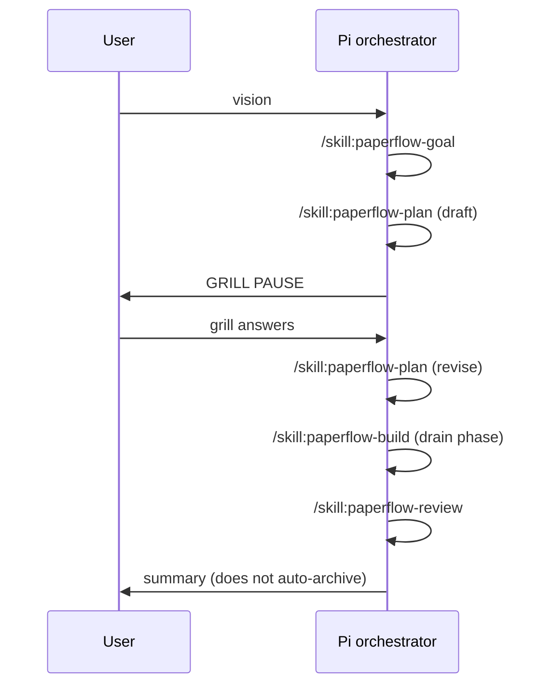

# paperflow-autopilot (pi-cursor)

Fra [paperflow autopilot](https://github.com/FRIKKern/paperflow/blob/main/skills/autopilot/SKILL.md).

## Sekvens



## Obligatorisk grill-pause

Etter draft: **stopp** til bruker har svart grill (browser Submit eller chat). `--skip-grill` kun ved eksplisitt bruker-forespørsel.

## CMUX + paperflow host

Anbefalt stack i cmux:

1. `paperflow` installert (daemon :8767, bridge, cmux dock)
2. `pi` med `pi-cursor` i workspace-pane
3. Autopilot åpner HTML underveis; grill Submit lander i Pi via bridge

Uten host: autopilot bruker samme skills men grill/revise i chat; plan HTML i `docs/paperflow/`.

## Preflight (når host finnes)

```bash
~/.local/bin/paperflow-preflight
~/.local/bin/paperflow-doctor --fast
```

Abort ved exit 2; advar ved exit 1.

## Transparens

Hvert steg skal etterlate lesbar artifact (HTML foretrukket) — ikke "alt i én orchestrator-blob".
